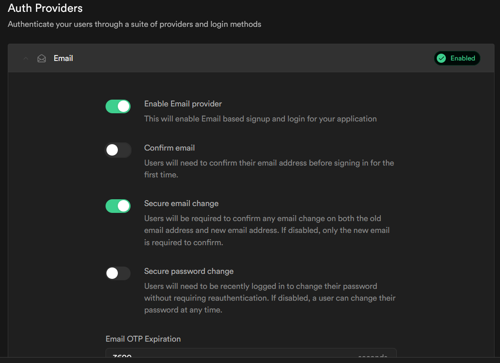
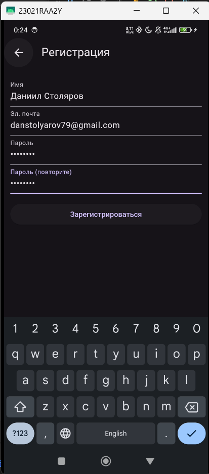
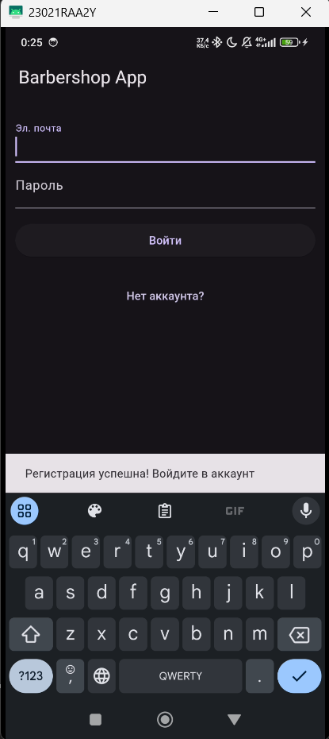
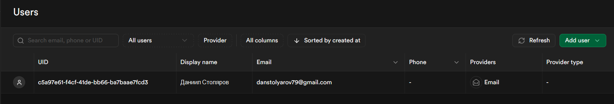
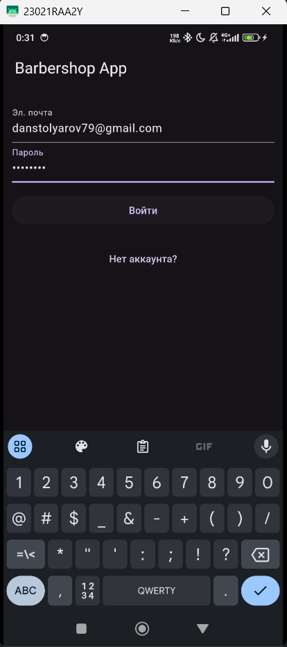
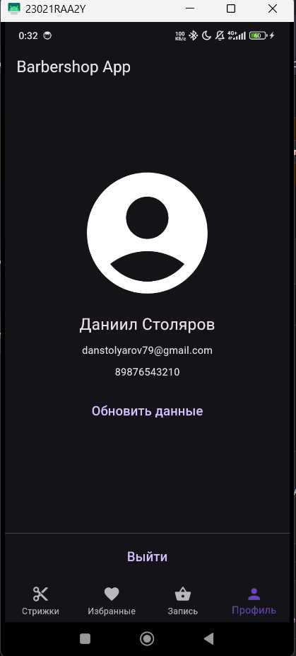

# Практика 11 Столяров ЭФБО-01-22 22T0318

## Задание.
Следуя руководству из видеоролика, создать форму регистрации и авторизации, используя supabase.

## Ход выполнения
### Шаг 1. Настройка аутентификации в supabase

### Шаг 2. Установка клиента supabase

<pre>flutter pub add supabase_flutter</pre>

### Шаг 3. Создание страниц логина и регистрации

### Шаг 4. Тестируем регистрацию, вход и выход
Примечание. С недавних пор supabase требует SMTP сервер для отправки email-подтверждений (без них возникает исключение при регистрации). Поэтому регистрация работает только для моего собственного email адреса.
https://stackoverflow.com/questions/79047884/supabase-error-email-address-cannot-be-used-as-it-is-not-authorized

Подтверждаем почту по ссылке из сообщения

Теперь в supabase появился наш пользователь

Можно войти и посмотреть на свои данные

(Телефон всё еще остаётся заглушкой)

По нажатию на Выйти, происходит Logout() и возвращается экран со входом.